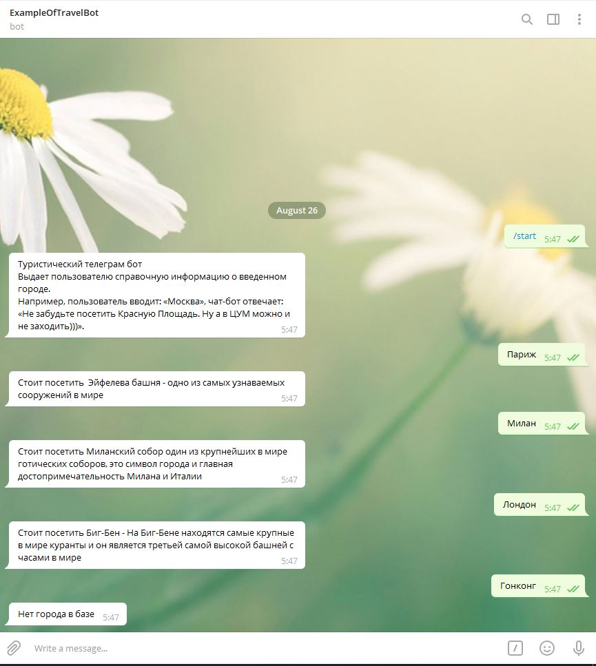

Необходимо создать web приложение по управлению собственным туристическим телеграм ботом.

 
1) Телеграм бот выдает пользователю справочную информацию о введенном городе. Например, пользователь вводит: «Москва», чат-бот отвечает: «Не забудьте посетить Красную Площадь. Ну а в ЦУМ можно и не заходить)))».

2) Данные о городах должны храниться в базе данных.

3) Управлять данными о городах (добавлять новые города и информацию о них, изменять и удалять любую информацию) необходимо через REST WebService.                        Используемые технологии: SpringBoot, SpringMVC, SpringData, Hibernate, Java не ниже 1.8. Для сборки проекта использовать Maven.

Исходный код приложения должен быть залит на GitHub, в файле readme указать, что необходимо для запуска (в том числе имя телеграм бота и его токен).

